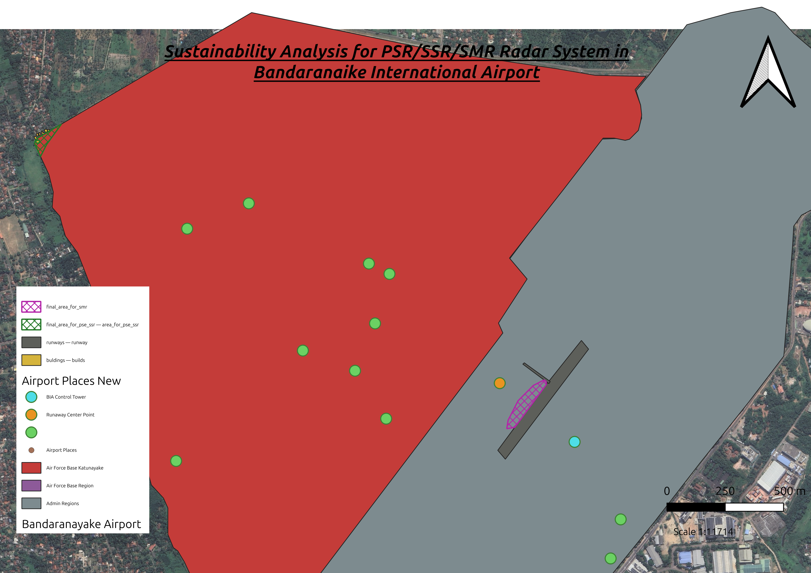
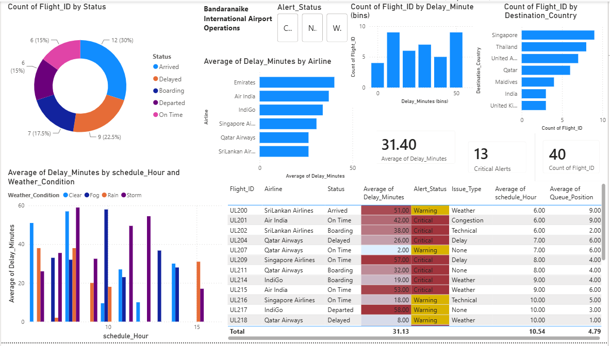

```{r setup, include=FALSE}
knitr::opts_chunk$set(
  echo = FALSE,
  warning = FALSE,
  message = FALSE,
  fig.align = "center",
  fig.pos = "H",
  out.width = "80%"
)

options(scipen = 999)

library(knitr)
library(kableExtra)
```


```{r}
library(tidyverse)
library(dplyr)
library(ggplot2)
library(car)
library(corrplot)
library(ggcorrplot)
library(RColorBrewer)
library(patchwork)
library(ggpubr)
library(nortest)
library(igraph)
library(readr)
library(ggraph)
library(tidygraph)

```

```{r}
set.seed(123)
```

\newpage

# 1.Acknowledgement 

First of all, I would like to sincerely thank Mr. Induranga de Silva for his valuable support, guidance, and encouragement throughout this project. His knowledge and expertise in statistical analysis and GIS helped me understand and overcome many of the technical challenges I faced while completing this assignment.
I would also like to thank everyone who helped and supported me during the completion of this project, even in small ways. I truly appreciate the time, advice, encouragement, and assistance given to me throughout this process.
Although I put a lot of effort into completing each part of this project, I believe that the support and guidance I received from many people played an important role in making this report a success. I am sincerely grateful to everyone who contributed to the completion of this project.


# 2.Executive Summary

This report focus on statistical modeling, social network analysis, spatial GIS database mapping, and business intelligence to evaluate operational efficiency at Bandaranaike International Airport (BIA). Regression analysis reveals that physical airport traffic capacity is the primary driver of passenger demand ($\beta = 0.4133, p < 0.001$), indicating that accelerating the BIA Phase 2 expansion project is far more vital to long term traffic growth than adjusting ticket pricing. Network centrality analysis identifies Cargo Operators and Fuel Supply Companies as critical structural cut nodes whose failure would isolate key ground handling and administrative stakeholders. Spatial site selection in QGIS and PostGIS explains that 4,189.9 m² of clear land near the Control Tower for Surface Movement Radar (SMR) and 11,140.9 m² inside Sri Lanka Air Force Base Katunayake for PSR/SSR deployment is available. Finally, Power BI dashboard tracking identifies an average flight delay of 31.40 minutes, suggesting peak arrival schedules and extreme weather conditions as the primary operational problems.  


\newpage

# 3.Introduction

Sri Lanka’s civil aviation sector plays a major role in supporting national tourism, trade, 
and economic growth.  This study aims to identify the practical application of combining statistical modeling, Geographic Information Systems
and business intelligence tools to generate actionable insights by examining passenger 
demand drivers, passenger network dynamics, spatial planning using QGIS, and real time operational 
monitoring using PowerBI dashboards. this report demonstrates how integrated data driven frameworks can enhance operational efficiency, safety in Sri Lanka’s aviation industry [@vasigh2014].


# 4.Task A
```{r}
df <- read.csv("../Data/Question-(a)/Air_Transport_Data.csv")
```


```{r}
df %>% str()
```
as mentioned in the data dictionary this is Air transport dataset with 200 observations with
7 variables with all of them are numerical variables and passenger_demand being target(dependent) variable. and other variables are independent variables [@doganis2010].


```{r}
df %>% summary()
```

Based on the summary statistic of the Air transport dataset, airport traffic range from a 
minimum of 69013 to a maximum of 336008, with a median of 199790 and a mean of 197962 The first and third quantiles are 164744and 225043 respectively. This distribution around the mean suggests a diverse airport traffic


The Average Income(USD per year) ranges from 26105 to 111233, with a median of 65946 and a mean of 66030. The first and third quantiles are 57730 and 73247, respectively. 


Fuel Price(USD per liter) varies from 0.5293 to 1.3618, with a median of 0.8884 and a mean of 0.8872. The first and third quartiles are 0.7809 and 0.9858 respectively. 


Average Ticket Fare spans from 142.1 to 355.3, with a median of 250.9 and a mean of 250.4.The first and third quartiles are 221.7 and 277.4, respectively.


Flight Frequency values range from 71.52 to 170.54, with a median of 122.61 and a mean of 122.57. The first and third quartiles are 109.38 and 134.37 respectively.


route_distance range from 341.5 to 2475.9 , with a median of 1579.1 and a mean of 1553.5. The first and third quartiles are 1298.3 and 1849.4 respectively.

Finally our target variable, Total Passenger Demand ranges from -60240(which is impossible in real life, because counts cannot be negative) to 268128 with a median of 109586 and a mean of 107811. The first and third quartiles are 68592 and 140320 respectively.


```{r}
df %>% head(10)

```

## 4.1 Univariate analysis

we will analyze each variable graphically and get initial insights from graphs then we develop hypotheses about variable distributions using graphical insights and then we will confirm them using Hypothesis testing statistics, specially normality test and other distribution tests.

basic hypothesis testing,

H0: variable follows a certain distribution

H1: variable does not follow a certain distribution

note that we will consider significance level(alpha) 5% in these tests

if the test statistic's p-value is less than 5% we reject our null hypothesis(H0) at 5% significance level, favoring our alternative hypothesis(H1) or in other words if we can't be at least 95% sure that variable follows that certain distribution we will reject null hypothesis. if the test statistic's p-value is greater than or equal to 5% we reject our alternative hypothesis(H1) at 5% significance level favoring our null hypothesis(H0) or in other words, if we can be 95% sure that variable follows that certain distribution we will fail to reject our null hypothesis.

### 1.airport_traffic Variable

```{r}
g1_1<-ggplot(data = df, aes(x = airport_traffic, y = ..density..)) + 
  geom_histogram(bins =20, color = "black", fill = "lightblue") +
  geom_density(color = "red", size = 1.0)

g1_1

```

from looking at the histogram it seems like the airport traffic is normally distributed.but we need to clarify the above claim using normality tests. 

hypothesis testing,

H0:airport traffic variable follows a normal distribution

H1:airport traffic variable does not follow a normal distribution


### a)Shapiro-Wilk Test

```{r}
shapiro.test(df$airport_traffic)

```

since p-value = 0.829> 0.05(alpha) we fail to reject our null hypothesis. that is shapiro wilk test strongly suggests that our airport traffic variable is normally distributed.

### b)Anderson-Darling Test

```{r}
ad.test(df$airport_traffic)

```

since p-value = 0.6586 > 0.05(alpha) we fail to reject our null hypothesis. that is anderson test also suggests that our airport traffic variable is normally distributed.

since both tests suggest that airport traffic is normally distributed we can verify it one more time using a QQ plot where we plot theoretical normal quantiles against our data sample quantiles

### c)Q-Q plot

```{r}
g1_3<-ggqqplot(df, x = "airport_traffic", 
               color = "blue",              
               ggtheme = theme_minimal())   
g1_3

```

from the Q-Q we can again conclude that our airport traffic variable is normally distributed as it almost perfectly align with the theoretical normal line shown in the Q-Q plot.


### 2.avg_income Variable

```{r}
g2_1<-ggplot(data = df, aes(x = avg_income, y = ..density..)) + 
  geom_histogram(bins =20, color = "black", fill = "lightblue") +
  geom_density(color = "red", size = 1.0)

g2_1

```

from looking at the histogram it seems like the avg_income Variable is normally distributed as it shows a bell curved shape but we need to clarify this claim using several normality tests and Q-Q plot. 

hypothesis testing,

H0: avg_income variable follows a normal distribution

H1: avg_income variable does not follow a normal distribution

### a)Shapiro-Wilk Test

```{r}
shapiro.test(df$avg_income)

```

since p-value = 0.2498 > 0.05(alpha) we fail to reject our null hypothesis(H0). that is shapiro wilk test suggests that our avg_income variable is normally distributed.


### b)Anderson-Darling Test

```{r}
ad.test(df$avg_income)

```

since p-value = 0.5256 > 0.05(alpha) we fail to reject our null hypothesis(H0). that is Anderson-Darling Test also suggests that our avg_income variable is normally distributed.

since both tests suggest that average income is normally distributed we can verify this claim one more time using a Q-Q plot.


### c)Q-Q plot

```{r}
g2_3<-ggqqplot(df, x = "avg_income", 
               color = "blue",              
               ggtheme = theme_minimal())   
g2_3

```

from the Q-Q we can see that our avg_income variable is normally distributed as it perfectly aligns with the theoretical normal quantiles as shown in the Q-Q plot. so we can conclude that average income is also normally distributed.


### 3.fuel_price Variable

```{r}
g3_1<-ggplot(data = df, aes(x = fuel_price, y = ..density..)) + 
  geom_histogram(bins =20, color = "black", fill = "lightblue") +
  geom_density(color = "red", size = 1.0)

g3_1

```

from looking at the histogram it seems like the fuel_price Variable is also normally distributed as the bell shape is present in the histogram but we need to clarify this claim using several normality tests and Q-Q plot. 

hypothesis testing,

H0: fuel_price variable follows a normal distribution

H1: fuel_price variable does not follow a normal distribution


### a)Shapiro-Wilk Test

```{r}
shapiro.test(df$fuel_price)

```

since p-value = 0.9218 > 0.05(alpha) we fail to reject our null hypothesis(H0). that is shapiro-wilk test statistic strongly suggests that fuel price variable is normally distributed.


### b)Anderson-Darling Test

```{r}
ad.test(df$fuel_price)

```

since p-value = 0.9789 > 0.05(alpha) we fail to reject our null hypothesis(H0). that is Anderson-Darling test statistic also suggests that fuel price variable is normally distributed. since both tests suggest that fuel price is normally distributed we can verify this claim one more time using a Q-Q plot.


### c)Q-Q plot

```{r}
g3_3<-ggqqplot(df, x = "fuel_price", 
               color = "blue",              
               ggtheme = theme_minimal())   
g3_3

```

from the Q-Q we can see that our fuel_price variable is normally distributed as it perfectly align with the theoretical normal line, this suggests our fuel price variable is normally distributed.


### 4.avg_ticket_fare Variable

```{r}
g4_1<-ggplot(data = df, aes(x = avg_ticket_fare, y = ..density..)) + 
  geom_histogram(bins =20, color = "black", fill = "lightblue") +
  geom_density(color = "red", size = 1.0)

g4_1

```

from looking at the histogram it seems like the avg_ticket_fare Variable is also normally distributed as the bell shape is present in the histogram but we need to clarify this claim using several normality tests and Q-Q plot. 

hypothesis testing,

H0: avg_ticket_fare variable follows a normal distribution

H1: avg_ticket_fare variable does not follow a normal distribution


### a)Shapiro-Wilk Test

```{r}
shapiro.test(df$avg_ticket_fare)

```

since p-value =  0.7774 > 0.05(alpha) we fail to reject our null hypothesis(H0). that is shapiro-wilk test strongly suggests that our avg_ticket_fare variable is normally distributed.


### b)Anderson-Darling Test

```{r}
ad.test(df$avg_ticket_fare)

```

since p-value = 0.8683 > 0.05(alpha) we fail to reject our null hypothesis(H0). that is Anderson-Darling Test also suggests that our avg_ticket_fare variable is normally distributed.

since both tests suggest that avg_ticket_fare is normally distributed we can verify this claim one more time using a Q-Q plot


### c)Q-Q plot

```{r}
g4_3<-ggqqplot(df, x = "avg_ticket_fare", 
               color = "blue",              
               ggtheme = theme_minimal())   
g4_3

```

from the Q-Q we can see that our avg_ticket_fare variable is normally distributed as it mostly align with the theoretical normal line and there almost no deviances from theoretical normal line as shown in the Q-Q plot. and also most ofdata points are inside the confidence interval region, this suggest our avg_ticket_fare variable is normally distributed.


### 5.flight_frequency Variable

```{r}
g5_1<-ggplot(data = df, aes(x = flight_frequency, y = ..density..)) + 
  geom_histogram(bins =20, color = "black", fill = "lightblue") +
  geom_density(color = "red", size = 1.0)

g5_1

```

from looking at the histogram it seems like the flight_frequency Variable is normally distributed as the bell shape is present in histogram but we need to clarify this claim using several normality tests and Q-Q plot. 

hypothesis testing,

H0: flight_frequency variable follows a normal distribution

H1: flight_frequency variable does not follow a normal distribution


### a)Shapiro-Wilk Test

```{r}
shapiro.test(df$flight_frequency)

```

since p-value = 0.6003 > 0.05(alpha) we fail to reject our null hypothesis(H0). that is shapiro-wilk test suggests that our flight_frequency variable is normally distributed.


### b)Anderson-Darling Test

```{r}
ad.test(df$flight_frequency)

```

since p-value = 0.336 > 0.05(alpha) we fail to reject our null hypothesis(H0). that is Anderson-Darling test also suggests that our flight_frequency variable is normally distributed.

since both tests suggest that flight_frequency is normally distributed we can verify this claim one more time using a graphical method which is Q-Q plot.


### c)Q-Q plot

```{r}
g5_3<-ggqqplot(df, x = "flight_frequency", 
               color = "blue",              
               ggtheme = theme_minimal())   
g5_3

```

from the Q-Q we can see that our flight_frequency variable is normally distributed as it mostly align with the theoretical normal line and there almost no deviances from theoretical normal line as shown in the Q-Q plot. and also most of data points are inside the confidence interval region, this suggest our flight_frequency variable is normally distributed.

### 6.route_distance

```{r}
g6_1<-ggplot(data = df, aes(x = route_distance, y = ..density..)) + 
  geom_histogram(bins =20, color = "black", fill = "lightblue") +
  geom_density(color = "red", size = 1.0)

g6_1

```

from looking at the histogram it seems like the route_distance Variable is normally distributed as the bell shape is present in histogram but we need to clarify this claim using several normality tests and Q-Q plot. 

hypothesis testing,

H0: route_distance variable follows a normal distribution

H1: route_distance variable does not follow a normal distribution


### a)Shapiro-Wilk Test

```{r}
shapiro.test(df$route_distance)

```

since p-value = 0.4398 > 0.05(alpha) we fail to reject our null hypothesis(H0). that is shapiro-wilk test suggests that our route_distance variable is normally distributed.


### b)Anderson-Darling Test

```{r}
ad.test(df$route_distance)

```

since p-value = 0.6498 > 0.05(alpha) we fail to reject our null hypothesis(H0). that is Anderson-Darling test also suggests that our route_distance variable is normally distributed.

since both tests suggest that route_distance is normally distributed we can verify this claim one more time using a graphical method which is Q-Q plot.


### c)Q-Q plot

```{r}
g6_3<-ggqqplot(df, x = "route_distance", 
               color = "blue",              
               ggtheme = theme_minimal())   
g6_3

```

from the Q-Q we can see that our route_distance variable is normally distributed as it mostly align with the theoretical normal line and there almost no deviances from theoretical normal line as shown in the Q-Q plot. and also most ofdata points are inside the confidence interval region, this suggest our route_distance variable is normally distributed.


### 7.passenger_demand(Target) Variable

```{r}
g7_1<-ggplot(data = df, aes(x = passenger_demand,y = ..density..)) + 
  geom_histogram(bins =20, color = "black", fill = "blue") +
  geom_density(color = "red", size = 1.0)

g7_1

```

from looking at the histogram it seems like the passenger_demand(Target) Variable is normally distributed as follows the symmetric bell shape which can be seen in the histogram. but we need to clarify this claim using several normality tests and Q-Q plot. 

hypothesis testing,

H0: passenger_demand variable follows a normal distribution

H1: passenger_demand variable does not follow a normal distribution


### a)Shapiro-Wilk Test

```{r}
shapiro.test(df$passenger_demand)

```

since p-value = 0.4249 > 0.05(alpha) we fail to reject our null hypothesis(H0). that is shapiro-wilk test suggests that our passenger_demand variable is normally distributed.


### b)Anderson-Darling Test

```{r}
ad.test(df$passenger_demand)

```

since p-value = 0.3862 > 0.05(alpha) we fail to reject our null hypothesis(H0). that is Anderson-Darling test also suggests that our passenger_demand variable is normally distributed.

since both tests suggest that passenger_demand is normally distributed we can verify this claim one more time using a Q-Q plot.


### c)Q-Q plot

```{r}
g7_3<-ggqqplot(df, x = "passenger_demand", 
               color = "blue",              
               ggtheme = theme_minimal())   
g7_3

```

from the Q-Q we can see that our passenger_demand variable is normally distributed as it mostly align with the theoretical normal line and there almost no deviances from theoretical normal line as shown in the Q-Q plot. and also most of data points are inside the confidence interval region, this suggest our passenger_demand(Target) variable is normally distributed.


## 4.2 Bivariate Analysis(Correlation analysis)

in this section we will analyse the relationship between our target variable(Total Passenger Demand) and each independent variable using graphical methods and some correlation tests.

here we will first inspect what kind of association is there between all independent variables and dependent variable using scatter plots. then we will use pearson correlation test as it shows linear association between two variables. but from the scatter plots if there seems to be a non linear relationship we will use kendall's tau test and spearman rho test statistics to further measure the association.


note that all test statistic scores are in between -1 and 1 and,
1 suggests strong positive correlation
0 suggests no correlation at all(2 variables are independent)
-1 suggests strong negative correlation

and magnitude of score suggests how strong is the relationship and sign suggests the relationship
negative or positive(ex: +0.9 means a strong positive association, -0.9 represents a strong negatvie association).

```{r}
df %>% summary()

```

### 1.airport_traffic Vs passenger_demand

```{r}
g8<-ggplot(data=df,aes(x=airport_traffic,y=passenger_demand))+geom_point(color="blue")+
  geom_smooth(method = "lm", color = "black", se = FALSE)+labs(
    title = "airport_traffic Vs passenger_demand"
  )
g8

```

from the scatter plot we can see that airport_traffic and passenger_demand have a linear a positive relationship we can clarify this using a above mentioned test

hypothesis testing,

H0: airport_traffic and passenger_demand are independent

H1: airport_traffic and passenger_demand are not independent

### a)Pearson test

```{r}
cor.test(df$airport_traffic, df$passenger_demand, method = "pearson")

```

r = 0.385401 suggests that airport_traffic and passenger_demand has a somewhat positive association and it is significant at 5% significant level

### b)Kendall's tau test


```{r}
cor.test(df$airport_traffic, df$passenger_demand, method = "kendall")

```

tau = 0.2518593  suggests that airport_traffic and passenger_demand has a somewhat positive association and it is significant at 5% significant level

### c)Spearman test

```{r}
cor.test(df$airport_traffic, df$passenger_demand, method = "spearman")

```

rho  = 0.3729573  suggests that airport_traffic and passenger_demand has a somewhat positive association and it is significant at 5% significant level

since all tests suggest that airport_traffic and passenger_demand are not independent(reject H0 because all p values < 0.05) and they have a weak positive relationship. we can say that the relationship is mostly linear by looking at the scatter plot.


### 2.avg_income Vs passenger_demand

```{r}
g9<-ggplot(data=df,aes(x=avg_income,y=passenger_demand))+geom_point(color="blue")+
  geom_smooth(method = "lm", color = "black", se = FALSE)+labs(
    title = "avg_income Vs passenger_demand"
  )
g9

```

from the scatter plot we can see that avg_income and passenger_demand do not have an association at all because the relationship line is almost a flat line

hypothesis testing,

H0: avg_income and passenger_demand are independent

H1: avg_income and passenger_demand are not independent

### a)Pearson test

```{r}
cor.test(df$avg_income, df$passenger_demand, method = "pearson")

```

r = 0.04954933 suggests that avg_income and passenger_demand are independent and it is not significant(i.e. no significant association) at 5% significant level(p = 0.4859>0.05)

### b)Kendall's tau test

```{r}
cor.test(df$avg_income, df$passenger_demand, method = "kendall")

```

tau = 0.03226131  suggests that avg_income and passenger_demand are independent and it is not significant(i.e. no significant association) at 5% significant level(p-value = 0.4975 > 0.05)

### c)Spearman test

```{r}
cor.test(df$avg_income, df$passenger_demand, method = "spearman")

```

rho  = 0.04349359 suggests that avg_income and passenger_demand are independent and it is not significant(i.e. no significant association) at 5% significant level(p-value = 0.5405 > 0.05)

since all tests suggest that avg_income and passenger_demand are independent(fail to reject H0 because all p values > 0.05) we can conclude that there is no association between avg_income and passenger_demand.


### 3.fuel_price Vs passenger_demand

```{r}
g10<-ggplot(data=df,aes(x=fuel_price,y=passenger_demand))+geom_point(color="blue")+
  geom_smooth(method = "lm", color = "black", se = FALSE)+labs(
    title = "fuel_price Vs passenger_demand"
  )
g10

```

from the scatter plot we can see that fuel_price and passenger_demand do not have an association at all because the relationship line is almost a flat line

hypothesis testing,

H0: fuel_price and passenger_demand are independent

H1: fuel_price and passenger_demand are not independent

### a)Pearson test

```{r}
cor.test(df$fuel_price, df$passenger_demand, method = "pearson")

```

r = 0.08567551 suggests that fuel_price and passenger_demand are independent and it is not significant(i.e. no significant association) at 5% significant level(p =  0.2277 > 0.05)

### b)Kendall's tau test

```{r}
cor.test(df$fuel_price, df$passenger_demand, method = "kendall")

```

tau = 0.03939698 suggests that fuel_price and passenger_demand are independent and it is not significant(i.e. no significant association) at 5% significant level(p-value = 0.4074 > 0.05)

### c)Spearman test

```{r}
cor.test(df$fuel_price, df$passenger_demand, method = "spearman")

```

rho  =0.059916 suggests that fuel_price and passenger_demand are independent and it is not significant(i.e. no significant association) at 5% significant level(p-value = 0.399 > 0.05)

since all tests suggest that fuel_price and passenger_demand are independent(fail to reject H0 because all p values > 0.05) we can conclude that there is no association between fuel_price and passenger_demand.


### 4.avg_ticket_fare Vs passenger_demand

```{r}
g11<-ggplot(data=df,aes(x=avg_ticket_fare,y=passenger_demand))+geom_point(color="blue")+
  geom_smooth(method = "lm", color = "black", se = FALSE)+labs(
    title = "avg_ticket_fare Vs passenger_demand"
  )
g11

```

from the scatter plot we can see that avg_ticket_fare and passenger_demand do not have an association at all because the relationship line is almost a flat line

hypothesis testing,

H0: avg_ticket_fare and passenger_demand are independent

H1: avg_ticket_fare and passenger_demand are not independent

### a)Pearson test

```{r}
cor.test(df$avg_ticket_fare, df$passenger_demand, method = "pearson")

```

r = -0.03039567 suggests that avg_ticket_fare and passenger_demand are independent and it is not significant(i.e. no significant association) at 5% significant level(p = 0.6692 > 0.05)

### b)Kendall's tau test

```{r}
cor.test(df$avg_ticket_fare, df$passenger_demand, method = "kendall")

```

tau = 0.007135678 suggests that avg_ticket_fare and passenger_demand are independent and it is not significant(i.e. no significant association) at 5% significant level(p-value = 0.8807 > 0.05)

### c)Spearman test

```{r}
cor.test(df$avg_ticket_fare, df$passenger_demand, method = "spearman")

```

rho  =0.01307283 suggests that avg_ticket_fare and passenger_demand are independent and it is not significant(i.e. no significant association) at 5% significant level(p-value = 0.8541 > 0.05)

since all tests suggest that avg_ticket_fare and passenger_demand are independent(fail to reject H0 because all p values > 0.05) we can conclude that there is no association between avg_ticket_fare and passenger_demand.


### 5.flight_frequency Vs passenger_demand

```{r}
g12<-ggplot(data=df,aes(x=flight_frequency,y=passenger_demand))+geom_point(color="blue")+
  geom_smooth(method = "lm", color = "black", se = FALSE)+labs(
    title = "flight_frequency Vs passenger_demand"
  )
g12

```

from the scatter plot we can see that flight_frequency and passenger_demand do not have an association at all because the relationship line is almost a flat line

hypothesis testing,

H0: flight_frequency and passenger_demand are independent

H1: flight_frequency and passenger_demand are not independent

### a)Pearson test

```{r}
cor.test(df$flight_frequency, df$passenger_demand, method = "pearson")

```

r = 0.05220582 suggests that flight_frequency and passenger_demand are independent and it is not significant(i.e. no significant association) at 5% significant level(p = 0.4628 > 0.05)

### b)Kendall's tau test

```{r}
cor.test(df$flight_frequency, df$passenger_demand, method = "kendall")

```

tau = 0.02824121 suggests that flight_frequency and passenger_demand are independent and it is not significant(i.e. no significant association) at 5% significant level(p-value = 0.5526 > 0.05)

### c)Spearman test

```{r}
cor.test(df$flight_frequency, df$passenger_demand, method = "spearman")

```

rho  =0.0438086  suggests that flight_frequency and passenger_demand are independent and it is not significant(i.e. no significant association) at 5% significant level(p-value = 0.5376 > 0.05)

since all tests suggest that flight_frequency and passenger_demand are independent(fail to reject H0 because all p values > 0.05) we can conclude that there is no association between flight_frequency and passenger_demand.


### 6.route_distance Vs passenger_demand


```{r}
g13<-ggplot(data=df,aes(x=route_distance,y=passenger_demand))+geom_point(color="blue")+
  geom_smooth(method = "lm", color = "black", se = FALSE)+labs(
    title = "route_distance Vs passenger_demand"
  )
g13

```

from the scatter plot we can see that route_distance and passenger_demand do not have an association at all because the relationship line is almost a flat line

hypothesis testing,

H0: route_distance and passenger_demand are independent

H1: route_distance and passenger_demand are not independent


### a)Pearson test


```{r}
cor.test(df$route_distance, df$passenger_demand, method = "pearson")

```

r = -0.04116275 suggests that route_distance and passenger_demand are independent and it is not significant(i.e. no significant association) at 5% significant level(p = 0.5628 > 0.05)

### b)Kendall's tau test

```{r}
cor.test(df$route_distance, df$passenger_demand, method = "kendall")

```

tau = -0.01959799 suggests that route_distance and passenger_demand are independent and it is not significant(i.e. no significant association) at 5% significant level(p-value = 0.6802 > 0.05)

### c)Spearman test

```{r}
cor.test(df$route_distance, df$passenger_demand, method = "spearman")

```

rho  = -0.0280432 suggests that route_distance and passenger_demand are independent and it is not significant(i.e. no significant association) at 5% significant level(p-value = 0.6932 > 0.05)

since all tests suggest that route_distance and passenger_demand are independent(fail to reject H0 because all p values > 0.05) we can conclude that there is no association between route_distance and passenger_demand.


Now we will see how each variable is correlated with other using a correlation map


```{r}

corr=df %>% relocate(passenger_demand, .after = last_col())

corr_matrix <- cor(corr, use = "complete.obs")

ggcorrplot(corr_matrix, 
           hc.order = TRUE, 
           type = "lower",
           outline.col = "black",
           ggtheme = ggplot2::theme_minimal(),
           colors = c("#6D9EC1", "white", "#E46726"),
           lab = TRUE, lab_size = 3.6)

```

as we can see from the correlation no independent variable is highly correlated with other independent variables, so there won't be any multicolinearity issues.


## 4.3 Regression analysis

since each independent variables are in different units, to make it fair to a regression we have to standardize

```{r}
df_standard <- df %>% 
  mutate(
    airport_traffic  = as.vector(scale(airport_traffic)),
    avg_income       = as.vector(scale(avg_income)),
    fuel_price       = as.vector(scale(fuel_price)),
    avg_ticket_fare  = as.vector(scale(avg_ticket_fare)),
    flight_frequency = as.vector(scale(flight_frequency)),
    route_distance   = as.vector(scale(route_distance)),
    passenger_demand = as.vector(scale(passenger_demand))
  )

df_standard %>% summary()

```

from the correlation analysis we identified that there is no significant association between target variable and independent variables except airport_traffic. so there is no point of carrying out a single variable linear regression analysis for other variables except airport_traffic.


### Only airport_traffic as a independent variable

```{r}
lm1 <- lm(passenger_demand ~ airport_traffic , data = df_standard)
summary(lm1)
AIC(lm1)

```

since R-squared of the model is 0.1485 means airport traffic variable alone can explain 14.85% variability in the passenger demand data. adjusted R-squared is 0.1442 and AIC 540.4138


even though adding other variables to the above model systematically doesn't make much difference (because they are mostly independent with the target variable) we can add and see which model makes the most predictive accuracy and find out overall best model using AIC and R squared value

Here we will use forward selection method,

```{r}
lm2 <- lm(passenger_demand ~ airport_traffic+avg_income , data = df_standard)
summary(lm2)
AIC(lm2)

```

adjusted R squared = 0.1401 decreased a bit and AIC = 542.3745 increased. so we will drop the avg_income.

```{r}
lm3 <- lm(passenger_demand ~ airport_traffic+fuel_price , data = df_standard)
summary(lm3)
AIC(lm3)

```

adjusted R squared = 0.1593 increased a bit and AIC = 537.8466 dropped.so we will keep fuel_price.

```{r}
lm4 <- lm(passenger_demand ~ airport_traffic+fuel_price+avg_ticket_fare, data = df_standard)
summary(lm4)
AIC(lm4)

```

adjusted R squared = 0.1603 increased a bit and AIC = 538.5866 increased a bit.so we will keep avg_ticket_fare.

```{r}
lm5 <- lm(passenger_demand ~ airport_traffic+fuel_price+avg_ticket_fare+flight_frequency, data = df_standard)
summary(lm5)
AIC(lm5)

```

adjusted R squared =  0.1617 increased a bit and AIC = 539.2281 increased a bit.so we will keep flight_frequency.

```{r}
lm6 <- lm(passenger_demand ~ airport_traffic+fuel_price+avg_ticket_fare+flight_frequency+route_distance, data = df_standard)
summary(lm6)
AIC(lm6)

```

adjusted R squared =  0.1574 decreased and AIC = 539.2281 increased.so we will drop route_distance.


so our final model is lm5 because it has the highest accuracy, but the AIC is higher than lm3 we will not consider that. because the AIC increased in lm5 is considerably low. so the regression equation would be


### passenger_demand = 0.4133(airport_traffic) + 0.1483(fuel_price) - 0.08615(avg_ticket_fare) +0.07601(flight_frequency) 


Here the regression analysis results show passenger demand in Sri Lanka is clearly driven more by inside structure limits than by ticket pricing. Overall airport traffic is the main growth factor which carries the highest positive coefficient in our model (0.4133, p < 0.001). This suggests that expanding physical capacity, specifically speeding up the BIA Phase 2 expansion project should be the top priority for aviation authorities like AASL [@caasl2021]. The second coefficient for fuel price (0.1483) reflects economic growth periods where high overall travel demand aligned with rising fuel costs, suggesting that state backed fuel hedging programs could help protect local airlines from global oil shocks. And average ticket fares showed a slight negative coefficient (-0.0862) which aligns with standard price deviations. Lastly, the positive coefficient for flight frequency (0.0760) highlights the value of schedule importance, advising slot management teams to boost weekly flight frequencies to key source markets during peak tourism months will definetly affect positively on torism sector in Sri Lanka.


# 5.Task B


```{r}
Edges <- read_csv("../Data/Question-(b)/SriLanka_Aviation_SNA_Dataset.csv")

head(Edges)
str(Edges)

```

## 5.1 Creating an undirected graph

```{r}
g <- graph_from_data_frame(Edges, directed = FALSE)

cat("Number of nodes (stakeholders):", vcount(g), "\n")
print(V(g)$name)

cat("Number of edges (relationships):", ecount(g), "\n")
cat("Network density:", round(edge_density(g), 3), "\n")
cat("Is the network fully connected?", is_connected(g), "\n")
cat("Average path length:", round(mean_distance(g), 2), "\n")
cat("Network diameter:", diameter(g), "\n")
cat("Average clustering coefficient:", round(transitivity(g, type = "average"), 3), "\n")

```


here in the created unfirected graph as we can see that there are 15 nodes and they are Bandaranaike International Airport (CMB),Mattala Rajapaksa International Airport (MRIA) ,Civil Aviation Authority of Sri Lanka (CAASL),Airport & Aviation Services SL (AASL),SriLankan Airlines,Mihin Lanka Sri Lanka Air Force, Ground Handling Unit,Air Traffic Control (ATC),Fuel Supply Companies, Maintenance & Engineering Customs & Immigration, International Airlines, Tourism Authority Cargo Operators and they are connectd by 28 edges resulting a fully connected network with density 0.267 which suggest that this is a sparse network. here the average path length(distance between two particular nodes) is 2 and the length of the longest geodesic (the longest shortest path between any pair of vertices) is 4.


## 3.2 Calculating centrality metrics

```{r}
deg  <- degree(g)
betw <- betweenness(g, normalized = TRUE)
clos  <- closeness(g, normalized = TRUE)   
eigen_cent  <- eigen_centrality(g)$vector          

results <- data.frame(
  Node          = names(deg),
  Degree        = deg,
  Betweenness   = round(betw, 4),
  Closeness     = round(clos, 4),
  Eigenvector   = round(eigen_cent, 4)
)
results <- results[order(-results$Degree, -results$Betweenness), ]
print(results)

```

here the degree centrality explains the raw count of direct connections which helps to identify busy hubs. betweenness explains how often a node sits on the shortest path between other pairs, simply it helps to identify bridges [@freeman1978]. Closeness helps to explain how quickly a node can reach all others. and finally,eigenvecor centrality helps to identify influence by association. here the cargo operators have the highest degree of 7 which is the most connected and busiest node and act as a bridge as well, and also this node has the highest closeness which explains that from cargo operators node we can reach to any other nodes easily. Customs & Immigration is the 2nd most connected node which also act as a between node but not so often as cargo operators. and it also comparatively close to other nodes. then Fuel Supply Companies, Bandaranaike International Airport (CMB),Sri Lanka Air Force  has the same degree but only Fuel Supply Companies act as a between node compared to other two. and all 3 have around same closeness.


Air Traffic Control (ATC) is a useful case for interpreting centrality because its degree centrality is only on mid range, tied with CAASL and MRIA and its betweenness score, while present, is lower than that of the network's two cut points. This gap between ATC's numerical centrality and its operational role illustrates an important distinction which is a node's importance to a network is not always proportional to how many connections it holds. ATC's significance lies in which stakeholders it sits between airlines, the regulator, and ground operations rather than in the raw number of its ties. This suggests that resilience planning should not treat centrality scores as the sole indicator of operational importance. Some coordinating roles carry criticality that a structural metric alone does not fully capture.


```{r}
write_csv(results, "../Generated Data/centrality_results.csv")

```

## 5.3 Identify the most influential nodes

```{r}
top_degree <- head(results[order(-results$Degree), "Node"], 3)
top_betw   <- head(results[order(-results$Betweenness), "Node"], 3)

cat("\nTop 3 by Degree Centrality")
print(top_degree)
cat("\nTop 3 by Betweenness Centrality")
print(top_betw)

```


as we can see here the most connected nodes are the, Cargo Operators ,Customs & Immigration, Fuel Supply Companies, Bandaranaike International Airport (CMB),Sri Lanka Air Force. and the top 5 critical between nodes are Cargo Operators,Fuel Supply Companies,Customs & Immigration, Bandaranaike International Airport (CMB)and Mattala Rajapaksa International Airport (MRIA).


## 5.4 Identify critical bridge nodes

```{r}
cut_nodes <- articulation_points(g)
print(cut_nodes)

cut_edges <- bridges(g)
print(cut_edges)

```


from the cut nodes and cut edges we can see that Fuel supply companies and Cargo Operators are cut nodes. Becuase Ground handling unit is only connect to to Fuel supply companies, if Fuel Supply Companies fail, Ground Handling Unit becomes completely isolated from the rest of the aviation sector. And also AASL is only connected to Cargo Operators, so if there is a failure on Cargo Operators AASL will be cut off from the whole network.


## 5.5 Identify clusters of interaction

```{r}
communities <- cluster_louvain(g, weights = E(g)$Weight)
cat("\nDetected communities (clusters):\n")
print(membership(communities))
cat("Modularity score:", round(modularity(communities), 3), "\n")

```

as we can see, there are four clusters formed:
Cluster 1 : Bandaranaike International Airport (CMB),International Airlines,Fuel Supply Companies Ground Handling Unit,Customs & Immigration and cluster 1 acts as a Ground Operations & Logistics Hub cluster.
Cluster 2: Mattala Rajapaksa International Airport (MRIA),SriLankan Airlines,Tourism Authority,Cargo Operators Airport & Aviation Services SL (AASL) and cluster 2 act as a Commercial Aviation & Tourism Aviation cluster.
Cluster 3: Sri Lanka Air Force,Maintenance & Engineering, Civil Aviation Authority of Sri Lanka (CAASL) Mihin Lanka.
Cluster 4: Maintenance & Engineering 


A modularity score of 0.331 [@blondel2008] indicates moderate community structure. that is stakeholders form meaningfully distinct clusters rather than being uniformly interconnected.

## 3.6 Visualizing

```{r}
set.seed(42)


net_tidy <- as_tbl_graph(g) %>%
  activate(nodes) %>%
  mutate(
    Degree = centrality_degree(),
    IsCut = name %in% cut_nodes,
    NodeType = ifelse(IsCut, "Articulation Point", "Other Stakeholder")
  )

ggraph(net_tidy, layout = 'kk') +
  geom_edge_link(aes(color = Relationship, width = Weight), alpha = 0.7) +
  scale_edge_width_continuous(range = c(0.8, 2.5), name = "Relationship Weight") +
  scale_edge_color_manual(values = c("Commercial" = "steelblue", "Regulatory" = "darkorange", 
                                     "Operational" = "forestgreen", "Support" = "purple")) +
  
  geom_node_point(aes(size = Degree, fill = NodeType), shape = 21, color = "black", stroke = 0.8) +
  scale_size_continuous(range = c(4, 10), name = "Degree Centrality") +
  scale_fill_manual(values = c("Articulation Point" = "tomato", "Other Stakeholder" = "lightsteelblue"), name = "Node Type") +
  
  geom_node_text(aes(label = name), repel = TRUE, size = 2.7, fontface = "bold", max.overlaps = 20) +
  
  
  scale_x_continuous(expand = expansion(mult = 0.22)) +
  scale_y_continuous(expand = expansion(mult = 0.15)) +
  
 
  coord_cartesian(clip = "off") +
  
  theme_void() +
  labs(
    title = "Sri Lanka Aviation Stakeholder Network",
    caption = "Red nodes represent structural cut nodes "
  ) +
  theme(
    plot.title = element_text(face = "bold", size = 13, hjust = 0.5),
    plot.subtitle = element_text(size = 9, hjust = 0.5, color = "gray30"),
    
    
    legend.position = "right",
    legend.title = element_text(size = 8, face = "bold"),
    legend.text = element_text(size = 7),
    legend.key.size = unit(0.35, "cm"),
    legend.spacing.y = unit(0.1, "cm"),
    
  
    plot.margin = margin(t = 15, r = 50, b = 15, l = 50)
  )

```


# 6.Task C


Under the Millennium Renovation Project at Bandaranaike International Airport in Katunayake 
upgrading air traffic surveillance infrastructure is essential for maintaining airspace 
safety and operational flow. Task C focuses on conducting a geospatial site suitability analysis
to determine optimal deployment locations for Primary Surveillance Radar (PSR), Secondary 
Surveillance Radar (SSR), and Surface Movement Radar (SMR) systems.


## 6.1 Brief Methodology and Steps Taken


* First georeferenced the aerial image of BIA and its suburbs using ground control points (GCPs) in Google Earth and QGIS under EPSG:5234 CRS then digitized the vector layers for airport boundaries, runways, buildings, and ground infrastructure.
* Created a spatial database named `SL_BIA_Aerial_Info` using PostgreSQL/PostGIS and added vector attribute tables with required columns (id, name, type, size) to store both spatial and non-spatial data.
* Generated a 300m buffer from CMB Control Tower and 200m buffer from Runway Center Point (RCP) for SMR deployment, and created a 2km to 3km ring buffer from RCP within Sri Lanka Air Force (SLAF) base area for co-located PSR/SSR deployment.
* Used geoprocessing tools like buffering, clipping, and spatial intersection in QGIS to isolate obstacle-free zones and extract exact spatial attributes.
* Calculated the total count of existing buildings, total building area footprint, and total available land area for both radar deployment sites.

 


\newpage

## 6.2 Map Layout

```{r, echo=FALSE, fig.cap="Digitized Aerial Map for Radar Deployment at BIA", out.width="90%", fig.pos="H"}

```


## 6.3 Geospatial Findings

From the geospatial data processing and spatial queries we got the following results for suitability areas:
  
- **SMR Zone (300m from Control Tower & 200m from RCP)**: 

  * Total buildings present: 2 buildings
  
  * Total building occupied area: 281.495 $m^2$
  
  * Total suitable land area available: 4189.9338 $m^2$
  
- **SSR/PSR Zone (2km to 3km from RCP within SLAF Base)**:

  * Total buildings present: 0 buildings
  
  * Total building occupied area: 0 $m^2$
  
  * Total suitable land area available: 11140.865 $m^2$


## 6.4 Discussion & Analysis

*The SMR needs a clear line of sight to keep an eye on ground movements across the runway,
taxiways, and aprons [@icao2018; @caasl2021]. The chosen spot gives great visibility with minimal obstructions, only requiring us to clear 2 small existing structures (281.495 m²).
  
*Setting up the co-located PSR and SSR systems 2 km to 3 km away from the runway center 
point keeps them far enough from big airport buildings to avoid signal interference [@icao2018].
  
*Placing these radars inside the Sri Lanka Air Force base solves land availability issues 
right away. It also gives us top-tier security, reliable backup power, and easier maintenance access.
  
*Once operational, these systems will give air traffic controllers full visibility in bad weather
and cut down the risk of runway collisions as flight traffic keeps growing at CMB.


# 7.Task D  
  
To help airport managers and air traffic controllers monitor day to day operations at Bandaranaike International Airport 
Task D focuses on building an interactive Business Intelligence (BI) dashboard using Power BI and the provided flight 
dataset (BIA_CMB_Dataset.csv). The dashboard brings together key metrics on flight schedules, delay patterns, 
international traffic flows, and real-time operational alerts into a single visual interface [@few2006].

## 7.1 Dashboard


```{r, echo=FALSE, fig.cap="PowerBI dashboard on Air traffic in Bandaranaike International Airport", out.width="105%", fig.pos="H"}

```


## 7.2 Discussion & Analysis

*The overall flight status summary shows that while most flights run on schedule, delays mainly stack up 
during peak arrival windows. Bad weather and air traffic congestion turn out to be the main causes behind 
longer turnaround times.

*Looking at traffic patterns by country, top source markets like India, the UAE, 
and the UK drive the highest passenger volumes. This helps ground teams allocate staff and immigration counters 
more effectively ahead of scheduled arrivals.

*Having all these metrics in one live dashboard replaces messy raw spreadsheets with clear visuals, 
allowing airport management to make fast, data-driven decisions during high-traffic periods.


\newpage
# 8.Appedices 

## Task A

\begin{center}
    \includegraphics[width=1\linewidth]{"../Data/Screenshots/Task A/1.png"}
    \\[30pt] 
    \includegraphics[width=1\linewidth]{"../Data/Screenshots/Task A/2.png"}
\end{center}

\newpage

\begin{center}
    \includegraphics[width=1\linewidth]{"../Data/Screenshots/Task A/3.png"}
    \\[30pt] 
    \includegraphics[width=1\linewidth]{"../Data/Screenshots/Task A/4.png"}
\end{center}

\newpage

\begin{center}
    \includegraphics[width=1\linewidth]{"../Data/Screenshots/Task A/7.png"}
    \\[30pt] 
    \includegraphics[width=1\linewidth]{"../Data/Screenshots/Task A/8.png"}
\end{center}

\newpage

\begin{center}
    \includegraphics[width=1\linewidth]{"../Data/Screenshots/Task A/9.png"}
    \\[30pt] 
    \includegraphics[width=1\linewidth]{"../Data/Screenshots/Task A/10.png"}
\end{center}

\newpage

\begin{center}
    \includegraphics[width=1\linewidth]{"../Data/Screenshots/Task A/11.png"}
    \\[30pt] 
    \includegraphics[width=1\linewidth]{"../Data/Screenshots/Task A/12.png"}
\end{center}

\newpage

\begin{center}
    \includegraphics[width=1\linewidth]{"../Data/Screenshots/Task A/13.png"}
\end{center}

\newpage

## Task B

\begin{center}
    \includegraphics[width=1\linewidth]{"../Data/Screenshots/Task B/1.png"}
    \\[30pt] 
    \includegraphics[width=1\linewidth]{"../Data/Screenshots/Task B/2.png"}
\end{center}

\newpage

\begin{center}
    \includegraphics[width=1\linewidth]{"../Data/Screenshots/Task B/3.png"}
    \\[30pt] 
    \includegraphics[width=1\linewidth]{"../Data/Screenshots/Task B/4.png"}
\end{center}

\newpage


## Task C

\begin{center}
    \includegraphics[width=1\linewidth]{"../Data/Screenshots/Task C/google_earth_pro_image.png"}
    \\[30pt] 
    \includegraphics[width=1\linewidth]{"../Data/Screenshots/Task C/QGIS_all_layers_loaded.png"}
\end{center}

\newpage

\begin{center}
    \includegraphics[width=1\linewidth]{"../Data/Screenshots/Task C/postgreSQL_integration.png"}
    \\[30pt] 
    \includegraphics[width=1\linewidth]{"../Data/Screenshots/Task C/full_pgadmin4_with_tables.png"}
\end{center}

\newpage

\begin{center}
    \includegraphics[width=1\linewidth]{"../Data/Screenshots/Task C/final QGIS with database integrated.png"}
    \\[30pt] 
    \includegraphics[width=1\linewidth]{"../Data/Screenshots/Task C/no of buildings in ssr zone.png"}
\end{center}

\newpage

\begin{center}
    \includegraphics[width=1\linewidth]{"../Data/Screenshots/Task C/area of 2 buldings in ssr zone.png"}
    \\[30pt] 
    \includegraphics[width=1\linewidth]{"../Data/Screenshots/Task C/suitable area for ssr zone.png"}
\end{center}

\newpage

\begin{center}
    \includegraphics[width=1\linewidth]{"../Data/Screenshots/Task C/suitable area for smr zone.png"}
\end{center}


\newpage

## Task D


\begin{center}
    \includegraphics[width=1\linewidth]{"../Data/Screenshots/Task D/1. dtsrting powerBI.png"}
    \\[30pt] 
    \includegraphics[width=1\linewidth]{"../Data/Screenshots/Task D/2.applying changes.png"}
\end{center}

\newpage

\begin{center}
    \includegraphics[width=1\linewidth]{"../Data/Screenshots/Task D/3. DAX thing.png"}
    \\[30pt] 
    \includegraphics[width=1\linewidth]{"../Data/Screenshots/Task D/4. hour creating.png"}
\end{center}

\newpage

\begin{center}
    \includegraphics[width=1\linewidth]{"../Data/Screenshots/Task D/5.final dashboard.png"}
    \\[30pt] 
    \includegraphics[width=1\linewidth]{"../Data/Screenshots/Task D/6. destination_country col.png"}
\end{center}

\newpage

\begin{center}
    \includegraphics[width=1\linewidth]{"../Data/Screenshots/Task D/8.final final dashboard.png"}
\end{center}


\newpage

# 9. References
